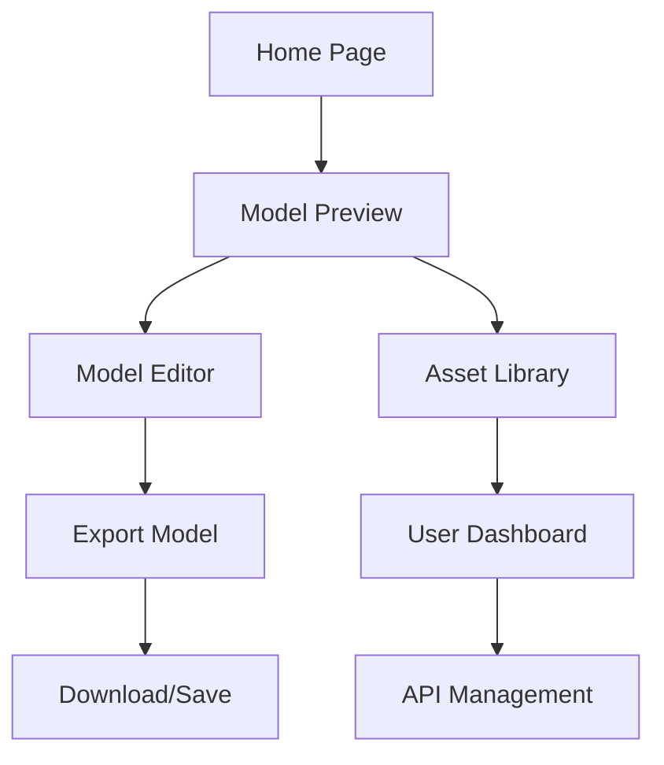

## 1. Product Overview
A professional 3D model preview and editing platform that enables users to generate, view, and edit 3D models with real-time rendering capabilities. The platform serves 3D artists, designers, and developers who need to visualize and modify their creations before final deployment.

The product helps users streamline their 3D content workflow by providing intuitive preview tools, editing capabilities, and asset management in a unified interface, reducing the time from creation to production-ready assets.

## 2. Core Features

### 2.1 User Roles
| Role | Registration Method | Core Permissions |
|------|---------------------|------------------|
| Free User | Email registration | Can preview models, basic editing, limited exports |
| Premium User | Subscription upgrade | Unlimited exports, advanced editing tools, batch processing |
| Enterprise User | Contact sales | API access, custom branding, team collaboration |

### 2.2 Feature Module
Our 3D model platform consists of the following main pages:
1. **Home page**: Hero section with featured models, navigation to key features, recent activity.
2. **Model preview page**: 3D viewport, model statistics, viewing controls, export options.
3. **Model editor page**: Advanced editing tools, material editor, lighting controls, animation timeline.
4. **Asset library page**: Model gallery, search and filter, batch operations, collections.
5. **User dashboard**: Profile management, subscription status, usage statistics, API keys.

### 2.3 Page Details
| Page Name | Module Name | Feature description |
|-----------|-------------|---------------------|
| Home page | Hero section | Display rotating 3D model showcase with smooth animations, call-to-action buttons for getting started |
| Home page | Navigation bar | Global menu with logo, main sections, user profile, notifications, settings |
| Home page | Featured models | Grid of highlighted 3D models with preview thumbnails, view counts, and like counts |
| Model preview page | 3D viewport | Real-time WebGL rendering with orbit controls, zoom, pan, reset view functionality |
| Model preview page | Model statistics | Display vertex count, face count, texture resolution, file size, format information |
| Model preview page | View controls | Toggle wireframe, shading modes, lighting presets, background options, screenshot capture |
| Model preview page | Export options | Download in multiple formats (GLB, OBJ, FBX), quality settings, texture inclusion |
| Model editor page | Material editor | Real-time material property adjustments, texture mapping, PBR parameter controls |
| Model editor page | Lighting controls | Dynamic lighting setup, environment maps, shadow adjustments, real-time preview |
| Model editor page | Animation timeline | Keyframe editing, playback controls, animation export, bone hierarchy visualization |
| Asset library page | Search and filter | Text search, category filters, date range, file format, poly count range |
| Asset library page | Model grid | Thumbnail previews with hover effects, quick actions menu, batch selection |
| Asset library page | Collections | Create custom collections, share collections, collaborative folders |
| User dashboard | Profile settings | Avatar upload, display name, bio, social links, notification preferences |
| User dashboard | Usage analytics | Model view statistics, download counts, storage usage, bandwidth consumption |
| User dashboard | API management | Generate API keys, view usage quotas, documentation access, webhook configuration |

## 3. Core Process

### Regular User Flow
1. User lands on homepage and browses featured 3D models
2. User clicks on a model to enter the preview page
3. In preview mode, user can rotate, zoom, and examine the model from different angles
4. User can switch to edit mode to modify materials, lighting, or animations
5. After editing, user can export the model in desired format and quality
6. User can save the model to their library or share it with others

### Premium User Flow
1. Premium users access advanced editing tools and batch processing features
2. They can upload multiple models for automated optimization
3. Access to premium material libraries and lighting presets
4. Priority rendering and faster export processing
5. API access for programmatic model processing

## 4. User Interface Design

### 4.1 Design Style
- **Primary colors**: Deep charcoal (#1a1a1a) background with electric cyan (#00d4ff) accents for interactive elements
- **Secondary colors**: Dark gray (#2d2d2d) panels, bright white (#ffffff) text, muted gray (#888888) for secondary text
- **Button style**: Rounded rectangles with subtle gradients, hover effects with glow animations
- **Typography**: Inter font family, 14px base size, clear hierarchy with weight variations
- **Layout style**: Three-panel layout with collapsible sidebars, card-based content organization
- **Icons**: Minimalist line icons with consistent stroke width, animated on interaction

### 4.2 Page Design Overview
| Page Name | Module Name | UI Elements |
|-----------|-------------|-------------|
| Home page | Hero section | Full-width dark gradient background, animated 3D model carousel, prominent CTA buttons with cyan accents |
| Model preview page | 3D viewport | Occupies 70% of screen width, black background for better contrast, floating toolbar with semi-transparent background |
| Model preview page | Control panel | Right sidebar with collapsible sections, tabbed interface for different tool categories |
| Asset library page | Model grid | Responsive grid layout, hover cards with 3D preview on mouse-over, infinite scroll loading |
| User dashboard | Analytics cards | Clean card layout with data visualizations, progress bars for usage quotas, interactive charts |

### 4.3 Responsiveness
- **Desktop-first approach**: Optimized for 1920x1080 and larger displays
- **Mobile adaptation**: Touch-friendly controls, simplified interface for smaller screens
- **Tablet optimization**: Landscape mode with adjusted panel layouts, gesture support for 3D navigation
- **Performance scaling**: Automatic quality adjustment based on device capabilities