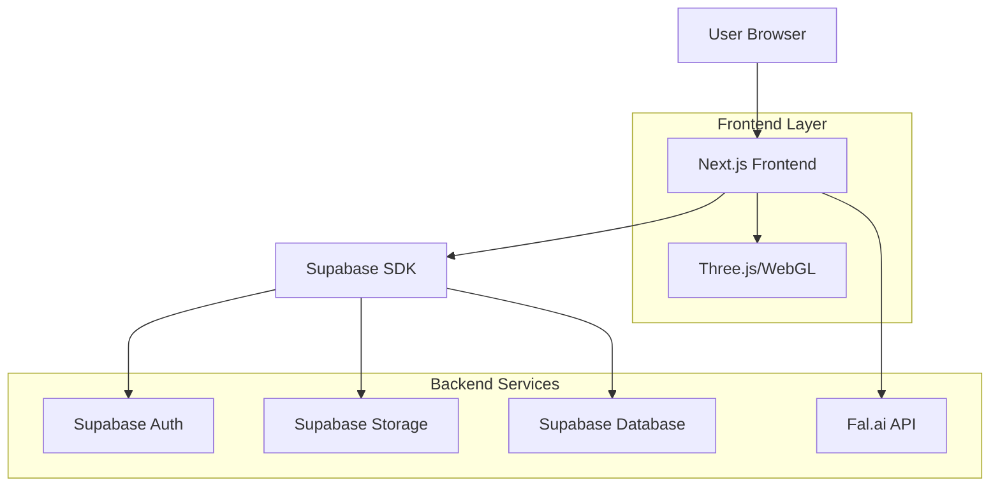
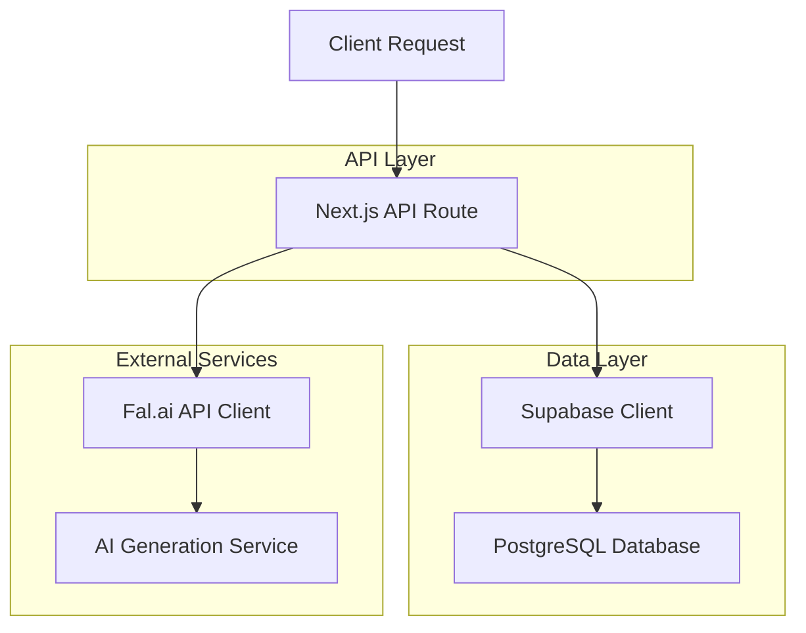
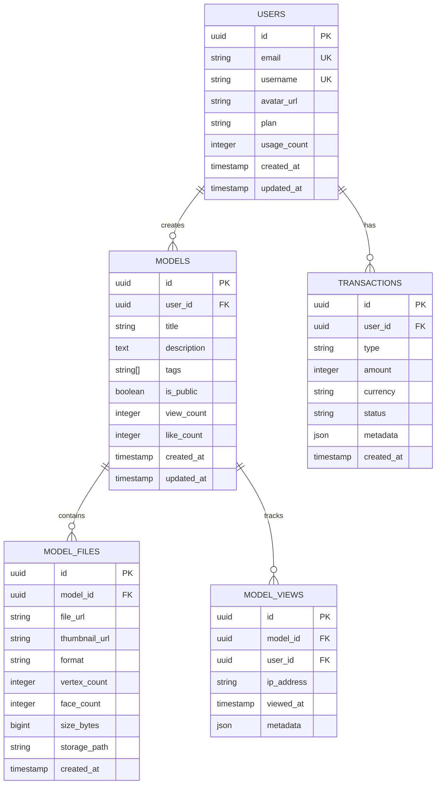

## 1. Architecture Design



## 2. Technology Description
- **Frontend**: Next.js 14 + React 18 + TypeScript + Tailwind CSS
- **3D Rendering**: Three.js + React Three Fiber + Drei
- **Backend**: Supabase (PostgreSQL, Auth, Storage)
- **AI Integration**: Fal.ai API for 3D model generation
- **State Management**: React Context + Zustand
- **UI Components**: Radix UI + Custom components

## 3. Route Definitions
| Route | Purpose |
|-------|---------|
| / | Home page with featured models and hero section |
| /gallery | Browse all public 3D models |
| /gallery/[id] | Individual model preview page |
| /editor/[id] | 3D model editing interface |
| /generator | AI-powered 3D model generation |
| /profile | User dashboard and settings |
| /pricing | Subscription plans and features |
| /api/auth/* | NextAuth.js authentication handlers |
| /api/works/* | Model CRUD operations |
| /api/fal/* | AI generation proxy endpoints |

## 4. API Definitions

### 4.1 Model Management API

**Get Model Details**
```
GET /api/works/[id]
```

Response:
```json
{
  "id": "uuid",
  "title": "Model Name",
  "description": "Model description",
  "model_url": "https://storage.supabase.co/model.glb",
  "thumbnail_url": "https://storage.supabase.co/thumbnail.jpg",
  "vertex_count": 2919,
  "face_count": 2091176,
  "format": "glb",
  "size_bytes": 5242880,
  "tags": ["character", "animal"],
  "is_public": true,
  "created_at": "2024-01-01T00:00:00Z",
  "user_id": "uuid"
}
```

**Update Model**
```
PUT /api/works/[id]
```

Request:
```json
{
  "title": "Updated Model Name",
  "description": "Updated description",
  "tags": ["character", "animal", "updated"]
}
```

### 4.2 AI Generation API

**Generate 3D Model**
```
POST /api/fal/3d
```

Request:
```json
{
  "prompt": "A fluffy white dog in running pose",
  "style": "realistic",
  "quality": "high",
  "format": "glb"
}
```

Response:
```json
{
  "job_id": "fal_job_uuid",
  "status": "processing",
  "estimated_time": 120,
  "model_url": null
}
```

**Check Generation Status**
```
GET /api/fal/3d/[job_id]
```

Response:
```json
{
  "job_id": "fal_job_uuid",
  "status": "completed",
  "model_url": "https://storage.supabase.co/generated_model.glb",
  "thumbnail_url": "https://storage.supabase.co/generated_thumbnail.jpg"
}
```

## 5. Server Architecture



## 6. Data Model

### 6.1 Database Schema



### 6.2 Data Definition Language

**Users Table**
```sql
CREATE TABLE users (
    id UUID PRIMARY KEY DEFAULT gen_random_uuid(),
    email VARCHAR(255) UNIQUE NOT NULL,
    username VARCHAR(50) UNIQUE NOT NULL,
    password_hash VARCHAR(255),
    avatar_url TEXT,
    plan VARCHAR(20) DEFAULT 'free' CHECK (plan IN ('free', 'premium', 'enterprise')),
    usage_count INTEGER DEFAULT 0,
    storage_used_bytes BIGINT DEFAULT 0,
    max_storage_bytes BIGINT DEFAULT 1073741824, -- 1GB for free users
    created_at TIMESTAMP WITH TIME ZONE DEFAULT NOW(),
    updated_at TIMESTAMP WITH TIME ZONE DEFAULT NOW()
);

-- Indexes
CREATE INDEX idx_users_email ON users(email);
CREATE INDEX idx_users_username ON users(username);
CREATE INDEX idx_users_plan ON users(plan);
```

**Models Table**
```sql
CREATE TABLE models (
    id UUID PRIMARY KEY DEFAULT gen_random_uuid(),
    user_id UUID NOT NULL REFERENCES users(id) ON DELETE CASCADE,
    title VARCHAR(255) NOT NULL,
    description TEXT,
    tags TEXT[],
    is_public BOOLEAN DEFAULT false,
    view_count INTEGER DEFAULT 0,
    like_count INTEGER DEFAULT 0,
    download_count INTEGER DEFAULT 0,
    processing_status VARCHAR(20) DEFAULT 'completed' CHECK (processing_status IN ('pending', 'processing', 'completed', 'failed')),
    created_at TIMESTAMP WITH TIME ZONE DEFAULT NOW(),
    updated_at TIMESTAMP WITH TIME ZONE DEFAULT NOW()
);

-- Indexes
CREATE INDEX idx_models_user_id ON models(user_id);
CREATE INDEX idx_models_public ON models(is_public) WHERE is_public = true;
CREATE INDEX idx_models_created_at ON models(created_at DESC);
CREATE INDEX idx_models_view_count ON models(view_count DESC);
```

**Model Files Table**
```sql
CREATE TABLE model_files (
    id UUID PRIMARY KEY DEFAULT gen_random_uuid(),
    model_id UUID NOT NULL REFERENCES models(id) ON DELETE CASCADE,
    file_url TEXT NOT NULL,
    thumbnail_url TEXT,
    format VARCHAR(10) NOT NULL CHECK (format IN ('glb', 'gltf', 'obj', 'fbx', 'stl')),
    vertex_count INTEGER,
    face_count INTEGER,
    size_bytes BIGINT NOT NULL,
    storage_path TEXT NOT NULL,
    is_primary BOOLEAN DEFAULT false,
    created_at TIMESTAMP WITH TIME ZONE DEFAULT NOW()
);

-- Indexes
CREATE INDEX idx_model_files_model_id ON model_files(model_id);
CREATE INDEX idx_model_files_format ON model_files(format);
CREATE UNIQUE INDEX idx_model_files_primary ON model_files(model_id) WHERE is_primary = true;
```

**Supabase Row Level Security Policies**
```sql
-- Enable RLS
ALTER TABLE models ENABLE ROW LEVEL SECURITY;
ALTER TABLE model_files ENABLE ROW LEVEL SECURITY;

-- Public models can be viewed by anyone
CREATE POLICY "Public models are viewable by everyone" ON models
    FOR SELECT USING (is_public = true);

-- Users can view their own models
CREATE POLICY "Users can view own models" ON models
    FOR SELECT USING (auth.uid() = user_id);

-- Users can create their own models
CREATE POLICY "Users can create own models" ON models
    FOR INSERT WITH CHECK (auth.uid() = user_id);

-- Users can update their own models
CREATE POLICY "Users can update own models" ON models
    FOR UPDATE USING (auth.uid() = user_id);

-- Users can delete their own models
CREATE POLICY "Users can delete own models" ON models
    FOR DELETE USING (auth.uid() = user_id);

-- Grant permissions
GRANT SELECT ON models TO anon;
GRANT ALL ON models TO authenticated;
GRANT SELECT ON model_files TO anon;
GRANT ALL ON model_files TO authenticated;
```